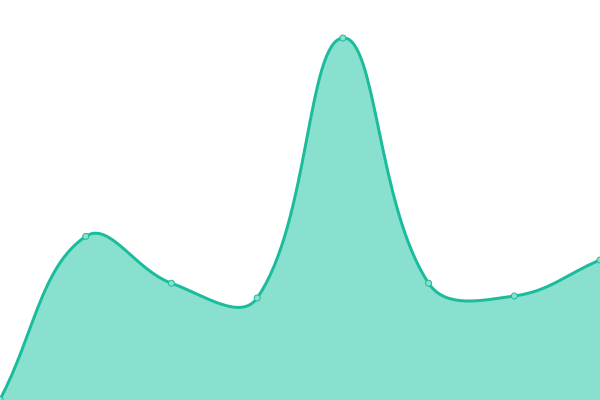
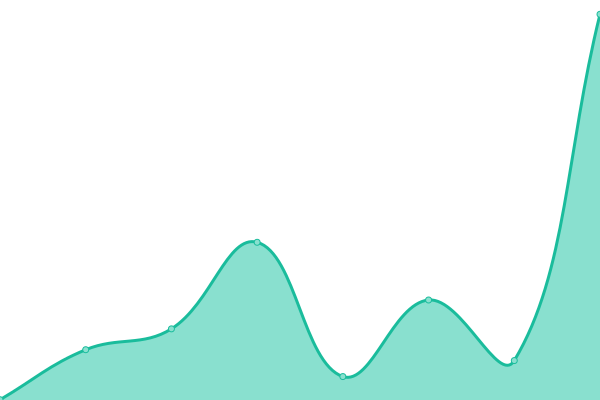
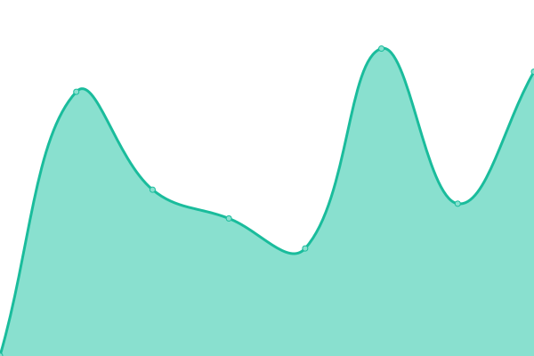
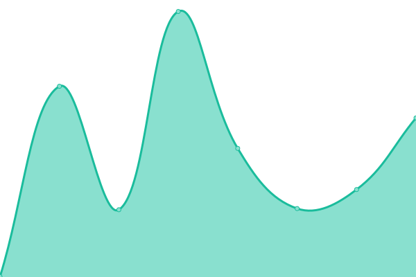

# [📈 Live Status](https://status.areeb.dev): <!--live status--> **🟩 All systems operational**

This repository contains the open-source uptime monitor and status page for [Areeb Ahmed](https://areeb.dev), powered by [Upptime](https://github.com/upptime/upptime).

With [Upptime](https://upptime.js.org), you can get your own unlimited and free uptime monitor and status page, powered entirely by a GitHub repository. We use [Issues](https://github.com/areebahmeddd/care_uptime/issues) as incident reports, [Actions](https://github.com/areebahmeddd/care_uptime/actions) as uptime monitors, and [Pages](https://status.areeb.dev) for the status page.

<!--start: status pages-->
<!-- This summary is generated by Upptime (https://github.com/upptime/upptime) -->
<!-- Do not edit this manually, your changes will be overwritten -->
<!-- prettier-ignore -->
| URL | Status | History | Response Time | Uptime |
| --- | ------ | ------- | ------------- | ------ |
|  [Landing](https://ohc.network) | 🟩 Up | [landing.yml](https://github.com/areebahmeddd/care_uptime/commits/HEAD/history/landing.yml) | 

 203ms
     
 | 

<a href="https://status.areeb.dev/history/landing">100.00%</a>
    

|  [Care](https://care.ohc.network) | 🟩 Up | [care.yml](https://github.com/areebahmeddd/care_uptime/commits/HEAD/history/care.yml) | 

 179ms
     
 | 

<a href="https://status.areeb.dev/history/care">100.00%</a>
    

|  [Care API](https://careapi.ohc.network) | 🟩 Up | [care-api.yml](https://github.com/areebahmeddd/care_uptime/commits/HEAD/history/care-api.yml) | 

 528ms
     
 | 

<a href="https://status.areeb.dev/history/care-api">100.00%</a>
    

|  [Documentation](https://docs.ohc.network) | 🟩 Up | [documentation.yml](https://github.com/areebahmeddd/care_uptime/commits/HEAD/history/documentation.yml) | 

 279ms
     
 | 

<a href="https://status.areeb.dev/history/documentation">99.33%</a>
    

|  [Leaderboard](https://contributors.ohc.network) | 🟩 Up | [leaderboard.yml](https://github.com/areebahmeddd/care_uptime/commits/HEAD/history/leaderboard.yml) | 

 237ms
     
 | 

<a href="https://status.areeb.dev/history/leaderboard">100.00%</a>
    

|  [School](https://school.ohc.network) | 🟩 Up | [school.yml](https://github.com/areebahmeddd/care_uptime/commits/HEAD/history/school.yml) | 

 1132ms
     
 | 

<a href="https://status.areeb.dev/history/school">100.00%</a>
    

<!--end: status pages-->

[**Visit our status website →**](https://status.areeb.dev)

## 📄 License

- Powered by: [Upptime](https://github.com/upptime/upptime)
- Code: [MIT](./LICENSE) © [Anand Chowdhary](https://anandchowdhary.com), supported by [Pabio](https://pabio.com)
- Data in the `./history` directory: [Open Database License](https://opendatacommons.org/licenses/odbl/1-0/)
